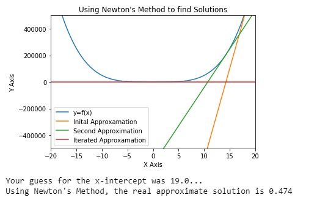

# NewtonsMethodVisualizer
This python program is used to simulate Newton's Method. This is a process in calculus in which the solution of a function can be approximated. The python program uses matplotlib to visualize and graph the data.

# Steps to Newton's Method
1) Provide an Estimation

In this step, the user will input a numerical estimation as to the root of the function f(x). In most cases, the guess that the user provides should result in the same outcome

2) Find the tangent line of f(x) at x. 

Using the user's guess and a bit of calculus, the tangent line of f(x) can be found. To do this, you must find point (a,b) such that a is the user's guess and b is f(a). Then, to find the slope of the tangent line, compute f'(a). With these two essential pieces of information, the tangent line equation can be set up as: y - b = m(x-a). 
This entire mathematical proccess is reflected in the python script under the function named "tangentline"

3) Find the x-intercept of the tangent line

After the tangent line is found at point x, the next step in the proccess is to find the root of the line. At this point, the cycle starts over and step 1 repeats. This time, instead of using an estimation, the root of the tangent line is used.

